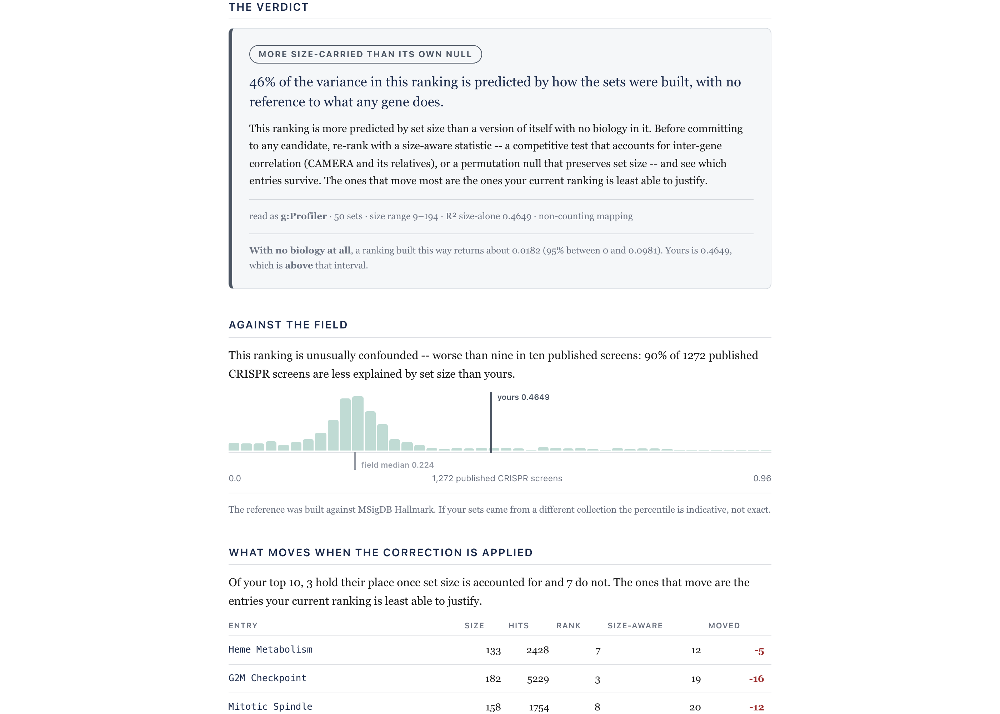
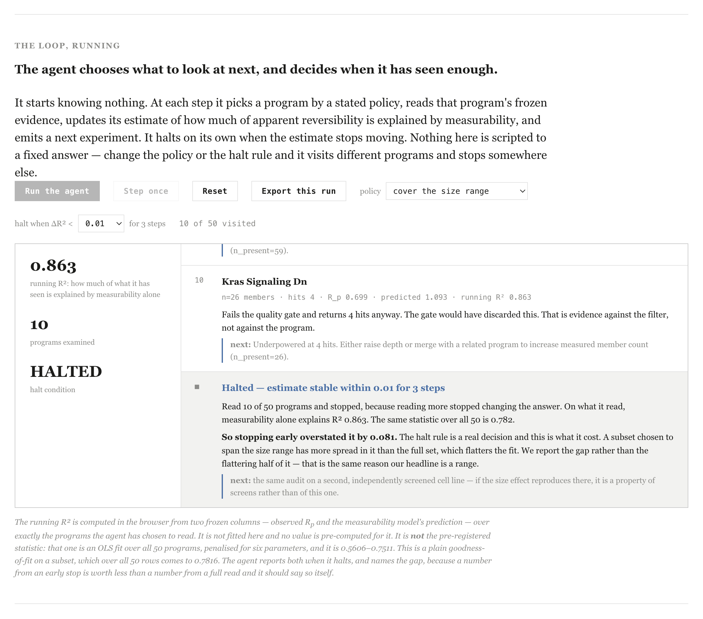
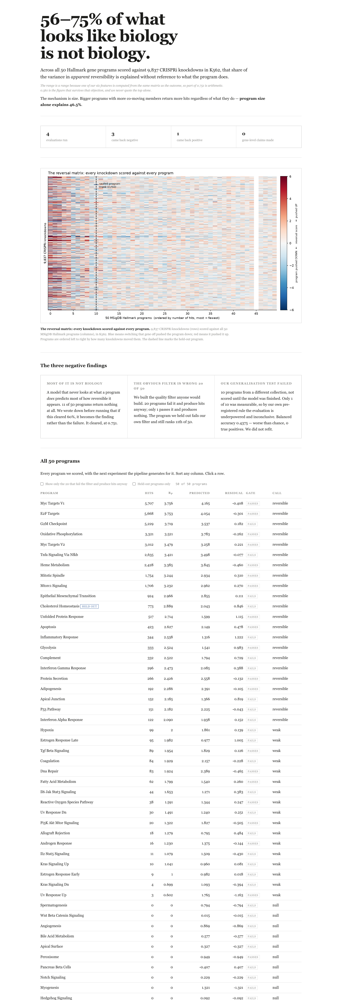
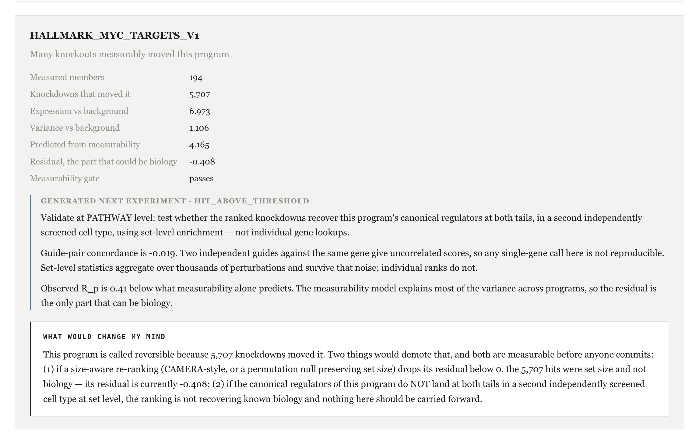
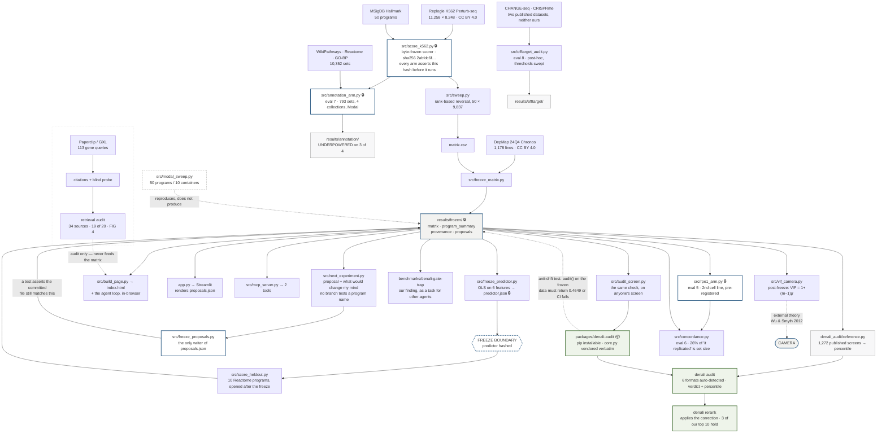

# denali 🏔

**A genome-scale CRISPRi screen, read back to ask what it can and cannot discover — and the answer is mostly an artifact of how the programs are defined, not their biology.**

[](https://github.com/alejandro-publius/denali/actions/workflows/ci.yml)
[](tests/test_frozen_invariants.py)
[](.python-version)
[](LICENSE)

A genetic screen hands a lab a ranked list of thousands of hits, and validating the top of it costs a year and six figures. **denali is the check you run before that decision.** It takes the table your gene-set analysis already produced and tells you how much of your ranking is explained by *how the sets were built* rather than by any biology.

```bash
pip install -e packages/denali-audit
denali audit my_results.csv
```

No column renaming. It reads **g:Profiler, DAVID, clusterProfiler, Enrichr/GSEApy, fgsea and GSEA desktop** output as-is — `denali formats` lists them — because the reason a check like this never gets run is that it asks you to reshape your data first.

What comes back is a verdict, a percentile against **1,272 published screens**, and a correction:

```
CONFOUNDED: 46% of the variance in this ranking is predicted by how the sets
were built, with no reference to what any gene does.

AGAINST THE FIELD
This ranking is unusually confounded — worse than nine in ten published
screens: 90% of 1272 published CRISPR screens are less explained by set
size than yours.
```

An R² is not a judgement until you know what normal looks like. The field's median is **0.224**; that output is denali's own screen at **0.465**, and the tool says so about us.

Then `denali rerank` applies the correction and shows you what leaves the top of your list. **On our own screen, three of the top ten hold and seven do not** — see [what the tool does to our own headline](#what-the-tool-does-to-our-own-result).

---

**Why trust it?** Because the study underneath it is the same check, run on our own data and then on everyone else's, and reported when it came back against us.

We scored all **50 MSigDB Hallmark gene programs** against **9,837 CRISPRi knockdowns** in K562 and asked which programs are *reversible* — which have many knockdowns that measurably move them. Then we asked the question underneath it: how much of that is biology at all. **Between 56% and 75% of the variance in apparent reversibility is explained by a model that never looks at what a program does.** It is a range and not a point because one of our six features is computed from the same matrix as the outcome, so part of the upper figure is arithmetic rather than discovery; **0.561** is the number that survives that objection and we never quote the top alone. The mechanism is size — bigger programs with more co-moving members return more hits regardless of their function, and **program size alone explains 46.5%**.

**And on seven other people's screens.** We ran the identical command on the published supplementary tables of seven external studies — CRISPR knockout, CRISPRi/a, single-cell CRISPRa, organoid, primary-T-cell, and bulk RNA-seq — and **36–88% of each ranking is explained by set construction alone.** Every input, provenance, and rerun command is in [`audits/external/`](audits/external/README.md); each number was verified against the source document and re-derived against this repo's own `src/audit_screen.py`. One study comes back only partially confounded and one candidate table was refused for having no true hit count — the auditor discriminates rather than flagging everything. The confound is not ours; it is the field's, and it is arithmetic.

**And eleven times against ourselves.** Seven of eleven evaluations came back negative, one returned no verdict when our own power rule fired, and all eleven are reported below. The headline was also recomputed by [a second implementation that never read the first](#the-headline-was-recomputed-by-a-second-implementation-that-never-read-the-first).

**New to CRISPR screens?** [Start with the plain-language section](#in-plain-language) — no jargon, and it explains why any of this matters before the method does.

**Evaluating this?** Four questions are answered with file paths at [**How to check this project**](#how-to-check-this-project), at the bottom. If you have two minutes rather than ten: the [findings table](#findings) is eleven rows and seven of them say NEGATIVE; the [loop](docs/LOOP.md) is where the agent chooses and halts; and `grep -n 'HALLMARK_\|REACTOME_' src/next_experiment.py` returns nothing, which is our central claim stated as something you can falsify in one command rather than something you have to believe.

**Read it at [alejandro-publius.github.io/denali](https://alejandro-publius.github.io/denali/).** The hosted copy is byte-identical to `index.html` in this repository and, like it, makes **zero network calls** — GitHub Pages serves the file, nothing fetches anything. So if the venue wifi dies, clone the repo and double-click `index.html`: same page, no server, no network. Everything in it is injected from `results/frozen/` at build time. A Streamlit view of the same frozen data lives in `app.py` (`streamlit run app.py`); both read `results/frozen/` and neither recomputes.



*What a user does: audit the ranking they already have, apply the correction the tool names, re-run the identical audit and watch the score drop. Or connect the frozen matrix to their agent — no API key, no backend.*



*The loop, mid-run. It picks each program by a stated policy, halts when its estimate stops moving, and reports that stopping early overstated its own answer by 0.081.*





*Click any program: the measured evidence, the generated next experiment, and **what would change my mind** — the specific numeric conditions that would demote this call, stated before the data that would test them.*

## What the tool does to our own result

`denali rerank` applies the correction the audit names and shows what leaves the
top of the list. Run on **our own screen**, the one this whole repository is
about:

```bash
denali rerank our_screen.csv --top 10
```

> Of your top 10, **3 hold their place** once set size is accounted for and
> **7 do not**. The ones that move are the entries your current ranking is least
> able to justify.

| entry | size | hits | rank → size-aware | |
|---|--:|--:|:--:|--:|
| `HALLMARK_MYC_TARGETS_V1` | 194 | 5,707 | **1 → 24** | −23 |
| `HALLMARK_OXIDATIVE_PHOSPHORYLATION` | 193 | 3,321 | 4 → 26 | −22 |
| `HALLMARK_E2F_TARGETS` | 190 | 5,668 | 2 → 21 | −19 |
| `HALLMARK_MTORC1_SIGNALING` | 176 | 1,706 | 9 → 27 | −18 |
| `HALLMARK_G2M_CHECKPOINT` | 182 | 5,229 | 3 → 19 | −16 |
| `HALLMARK_MITOTIC_SPINDLE` | 158 | 1,754 | 8 → 20 | −12 |
| `HALLMARK_HEME_METABOLISM` | 133 | 2,428 | 7 → 12 | −5 |

**Our number one falls to twenty-fourth.** `MYC_TARGETS_V1` is the largest set
in the collection at 194 measured members, it returned the most hits, and once
you ask how many hits a set that size returns *anyway*, it is unremarkable. The
three that hold are the three the ranking can actually justify.

Note what the tool refuses to do here. It does not tell you the three survivors
are real, and it does not hand back a shorter list to go chase. Its own output
says so: *"Not a candidate list. This says which entries were carried by size,
not which to chase."* The correction is `log10(1+hits)` regressed on set size,
ranked by residual — stated in the output, so you can disagree with it.

We put our own screen through this rather than a borrowed example on purpose. A
tool that demotes its author's top hit by twenty-three places is a stronger
argument than any paragraph about why you should trust it.

## What we chose, and why

Stated up front because every one of these is attackable, and a reader should not
have to infer that we picked well.

1. **MSigDB Hallmark, not our own gene sets.** This is the field's own curated
   standard, so the size critique cannot be dismissed as an artifact of how *we*
   drew the boundaries — the sets were drawn by someone else, for other purposes,
   before we existed. Hallmark also spans a 6× size range (32 to 200 declared members), which is what makes the size effect visible at all. A collection of
   uniformly-sized sets would have hidden it.

2. **K562, because the screen exists.** Replogle et al. published a genome-scale
   CRISPRi Perturb-seq screen covering 9,837 knockdowns; nothing at that scale was
   going to be generated here. The cost is real and we state it rather than bury
   it: K562 is an unstressed leukemia line, and our own first program failed its
   known-regulator control for exactly that reason.

3. **Eleven evaluations, seven of them negative.** Where an evaluation was
   pre-registered, the alternative claim was named before any value was computed,
   so a null was a publishable outcome rather than a failure. Seven came back
   negative, one returned no verdict at all because our own power rule fired, and
   two came back positive — one of which is a control, and it is labelled a
   control because that is what it is.

4. **Program level, never gene level.** Guide-pair concordance is −0.019: two
   independent reagents against the same gene disagree. That forbids any
   single-gene claim in this dataset, including a flattering one, and it is
   enforced by a test that fails the build rather than by our good intentions.

**What we deliberately did not attempt.** No structural or sequence-design claim,
because the concordance figure above forbids the gene-level claim one would have
to rest on. No candidate list and no ranked "top programs" table, because that is
the nomination the pre-registration refuses to make. No second cell line: RPE1 was
available and we checked it, but it covers only 24.3% of K562's targets and that
quarter is disproportionately the essential-gene subset — a control we ran and
published as a **FAIL** (94.1% vs 11.3% coverage, essential vs non-essential).
Running it anyway and calling it replication would have been the easiest available
overstatement.

## Findings

Eleven evaluations. Seven negative, one with no verdict because our own power rule fired. All eleven are reported. The eighth leaves our own data entirely: it asks the same question of two published clinical CRISPR off-target datasets. The eleventh leaves the data altogether and asks the literature.

| # | Evaluation | Result | Verdict |
|---|---|---|---|
| 1 | Is apparent reversibility biology? | adj R² **0.561–0.751** from measurability alone; program size alone 0.465 | **NEGATIVE** — pre-registered branch (b) fired |
| 2 | Does the obvious quality filter work? | **20 of 50** programs fail the gate and produce hits anyway; only **1** passes and produces nothing | **NEGATIVE** — the filter would have discarded our own best result |
| 3 | Does the predictor generalise? | **1 of 10** held-out programs measurable → underpowered and inconclusive; balanced accuracy **0.4375**, **zero** true positives | **NEGATIVE** — not refit |
| 4 | Does the ranking work at all? | Master regulator at rank 2/11,258; **11 of 17** canonical pathway members in the extreme 10%, p = 7.0×10⁻⁸, correct sign at both tails | **POSITIVE** — a control, not a discovery |
| 5 | Does the size effect hold in a second cell line? | RPE1, independently screened: size alone **R² 0.276**, slope **+0.0116**, p = 1.1×10⁻⁴, 49 of 50 scoreable | **POSITIVE** — pre-registered at ≥0.25, and it cleared by 0.026 |
| 6 | When two screens agree, is that biology? | Raw cross-screen agreement ρ **+0.663**; after removing set size, **+0.493**. **26% of the apparent replication is set size.** Size alone predicts **6 of the top 10** programs in the second screen | **NEGATIVE** — post-freeze, not pre-registered |
| 7 | Does the confound worsen in the annotations biologists actually use? | **UNDERPOWERED on 3 of 4 collections** — the pre-registered power rule fired before the deciding statistic could be applied. Descriptive, not pre-registered: **98% of Hallmark sets are scoreable against a genome-scale screen; 46% of GO Biological Process sets are** | **NO VERDICT** — and our prediction was wrong in direction |
| 8 | Does the same confound run in clinical CRISPR off-target nomination? | Two published datasets, neither ours. **CHANGE-seq vs GUIDE-seq**, 56 paired guides, 202,043 nominated sites: across seven swept read thresholds, **17.6–33.9% (median 31.2%)** of biochemical–cellular agreement is explained by **search yield**, not the guide. **85.2%** of nominated sites sit at 5–6 mismatches. **CRISPRme**, 14 therapeutic guides: **44.1%** of top-ranked sites score best on an alt allele, but only **12.4%** are absent from the reference | **NEGATIVE** — post-hoc, thresholds swept |
| 9 | Does the confound survive when the program is actually switched on? | Adamson 2016 UPR Perturb-seq, **pre-registered before the substrate was opened**. Engagement established first: mean effect **0.0551** vs a size- and expression-matched null's 99th percentile **0.0487**, p = 0.001. Then size alone explains **R² 0.269**, slope **+0.0072**, p = 1.2×10⁻⁴, **50 of 50** scoreable | **NEGATIVE** — pre-registered claim (a): the confound **persists under engagement** |
| 10 | Does our headline describe the field, or just our screen? | **1,272** published screens (BioGRID ORCS) from **187** publications: median size-alone R² **0.224**, mean 0.253; **9.6%** of screens reach our 0.465 — but **26.7%** of *publications* do, because one publication is 26.7% of the corpus; the gradient across hit-list-size bins (0.056 → 0.184 → 0.226 → 0.263) is monotonic | **NEGATIVE** — post-hoc, not pre-registered. Our screen is above the field's 90th percentile by screen but only its **73rd by publication**, and quoting 46.5% as typical would overstate the field ~2× |
| 11 | Does the field say so? | Of the **187** publications behind those screens, **111** resolved to full text in PubMed Central and **4** — **3.6%** — mention gene-set size anywhere; 14.4% use competitive-test machinery. Positive control: all three enrichment-methods papers fire, so the low rate is a rate and not a dead query | **POSITIVE** — pre-registered branch (b) fired (`docs/LITERATURE_PREREG.md`, sha256 `165d91a2…`, sealed at `b0c5e35` before the run). Arm is post-freeze. Measures **mention, not understanding**, over a **59.4%** open-access denominator |

**Evaluation 8 leaves our data and the finding survives.** The confound this project found in gene sets is not about gene sets. In a CRISPR off-target list the analogue of set size is **search yield** — how many candidate sites the mismatch budget nominated — and it carries roughly the same share of apparent cross-assay agreement as set size carries of our cross-screen agreement: **31.2% median against our 26%.** Same direction, modestly stronger, and we do not say dramatically. Two things are disclosed rather than buried. First, the *other* regression — search yield against the **biochemical** hit count — returns R² **0.83–1.00** and exactly **1.0000** at the two lowest thresholds, because a nominated site with ≥1 read is a hit by construction; that number is an identity, not a finding, and it is the one this arm would have overstated itself with. Second, on CRISPRme: that variants create off-target sites is **the CRISPRme paper's own finding**, not ours, and the 44.1% figure means a variant makes the site a *better* match — the stricter reading, sites absent from the reference entirely, is **12.4%**. We conflated those two while building this arm; quoting the first while describing the second overstates the effect roughly threefold. The denominator is the top 1,000 by CFD per guide, a ranked shortlist, not the genome. **No guide is named safe or unsafe** — the gene-level refusal, applied where the ranking has a patient at the end of it. → [`docs/OFFTARGET.md`](docs/OFFTARGET.md), `src/offtarget_audit.py`

**Evaluation 10 ran our audit on the field itself, and our own headline came back atypical.** BioGRID ORCS 2.0.18 ships 1,952 curated human CRISPR screens from 418 publications with an explicit HIT column; 1,272 meet the inclusion rule. The median published screen shows size-alone R² **0.224** — our 0.465 sits above the field's 90th percentile, so quoting it as if it described screens generally would overstate the field by roughly 2×. The two numbers are **not the same estimand** (different unit, outcome and predictor — the comparison table is in `docs/CORPUS.md`), a smaller field median does not falsify ours, and an independent execution of the same idea landed near 0.10 and could not be reconciled, so neither number is "the field's value." Post-hoc, not pre-registered, names no screen and no publication. See `docs/CORPUS.md` and `results/corpus/`.

**Evaluation 7 failed twice and we are reporting both.** We predicted the size confound would get *worse* in looser collections. It did not: GO-BP 0.2905 and Reactome 0.1846, both **below** Hallmark's 0.4649 — the opposite direction. And separately, the pre-registered rule (150 of 250 sets must be scoreable) fired on three of four collections, so strictly no verdict is issued at all and the R² values above carry none. What survives is descriptive and was not the question we asked: **more than half of GO Biological Process — the most-used gene-set collection in biology — cannot be evaluated against this screen, because the median GO-BP set declares 20 genes and has 8 measured in this screen.** 793 sets across four collections, scored on Modal in 522 s. **The comparator is Hallmark's size-alone R², 0.4649**, computed over all 50 frozen programs; the arm's own Hallmark row reads 0.4464 because one set (`HALLMARK_PANCREAS_BETA_CELLS`, 9 members) fails a stricter scoreability gate here than in the original sweep — a sample-size difference of 0.0186, not drift, reconciled in the artifact. GO-BP and Reactome sit below Hallmark under **both** figures, so the direction claim is unaffected either way. The 0.4649 bar itself comes from `results/sensitivity/stripped_model.json`, which is **post-freeze and not pre-registered** — disclosed rather than dressed up, and it reproduces from the frozen matrix in one line.

**Evaluation 6 is the one to remember.** "It replicated in a second cell line" is the strongest evidence most hit lists ever get. We measured what that evidence is worth: **you can predict 6 of the top 10 programs in an independent screen using nothing but how many genes are in each set.** Both screens are confounded the same way, so agreeing for the same wrong reason looks exactly like agreeing for the right one. Post-freeze and not pre-registered, and labelled so — prompted by our own landscape review noticing we had no right to claim a number here. `src/audit_screen.py --hits-b` runs this on anyone's paired screens.

**On evaluation 5, the margin is thin and we are not going to pretend otherwise.** The pre-registered bar was R² ≥ 0.25 and the result is 0.2758 — it clears by 0.026. It is a genuine pre-registered positive, the threshold was fixed and hashed before the sweep ran ([`docs/RPE1_PREREG.md`](docs/RPE1_PREREG.md), sha256 `ae62feda…`, committed at `f509baa`), and the same byte-frozen scorer was used unmodified. But a bar cleared by that little would have been missed by a slightly noisier screen, and **this is a generalisation test, not a replication**: RPE1 covers 24.3% of K562's targets and that quarter is disproportionately essential genes — our own `rpe1_coverage_collision` control, which **FAILS** at 94.1% vs 11.3%. What it supports is that the size effect is a property of set-level statistics rather than of K562 alone. It does not make the K562 number more precise, and it does not revise the frozen primary.

Also measured: essentiality density is flat at program level, coefficient **−0.021**, p = 0.90. It dominates individual hit lists and predicts nothing about whether a program is reversible.

## Features

- **An agent that chooses its own next step and halts on its own** — it picks which program to read by a stated policy, updates a running estimate, emits a next experiment, and stops when the estimate stops moving. Change the policy or the halt rule and it visits different programs and stops elsewhere. On halting it reports that stopping early **overstated its own answer by 0.081**, and names the gap
- **A next experiment that changes when the results change** — zero hits proposes raising statistical power and re-running; a strong result proposes pathway-level validation in a second cell type. No branch tests a program name
- **A packaged CLI anyone can install** — `pip install -e packages/denali-audit` puts `denali` on PATH with four subcommands: `audit` (verdict + corpus percentile), `rerank` (apply the correction, see what leaves your top N), `replication` (two screens agreed — how much of that is set size?) and `formats` (the six tool outputs read without renaming a column). `core.py` is this repository's own maths vendored verbatim, and a test requires it to return exactly **0.4649** on the frozen research data, so the tool and the paper cannot drift apart
- **The check runs on other people's screens, and here it is doing so** — `src/audit_screen.py` takes any gene-set results table and reports the same estimate; validated against synthetic screens with known answers, and it reproduces our own figure exactly. [`audits/external/`](audits/external/README.md) is the same command run unchanged on the published supplementary tables of **seven studies we did not run and did not choose** — CRISPR-KO, CRISPRi/a, single-cell CRISPRa, organoid, primary T cell and bulk RNA-seq — where **36–88%** of each ranking is explained by set construction alone. One comes back only partially confounded and one candidate table was refused for having no true hit count, so the auditor discriminates rather than flagging everything
- **Genome-scale sweep** — every one of 9,837 knockdown targets scored against all 50 Hallmark programs, 491,850 cells; the full matrix ships in the repo rather than a filtered top-N
- **Rank-based reversal statistic** — Mann–Whitney of program-member effects against the rest of the transcriptome, per perturbation, with cosine similarity and mean effect size reported alongside so no single number carries the claim
- **Pre-registered thresholds, hashed before any value was computed** — the primary claim, the alternative claim, the statistic deciding between them, and the conditions for reporting neither, all fixed in advance
- **Held-out evaluation scored only after the predictor was frozen** — the model is serialised and hashed (`610f2a75…`), the hash verified at load time, and the ten programs opened only afterwards; a mismatch aborts
- **DepMap essentiality filter** — every row joined to Chronos gene effect across 1,178 lines and tiered by it, separating "this knockout moves the program" from "this knockout kills the cell"
- **Seven controls with published outcomes, four of them failing** — a pre-committed nonsense program returns zero hits against 517 and 773; guide-pair concordance is −0.019; top-50 essentiality enrichment is 4.09×. The failures are kept, not dropped
- **Literature layer with per-gene provenance and a measured retrieval audit** — 113 genes, one citation each via Paperclip, then a blind 20-gene probe that found **19 of 20 returning the same unrelated paper**; we report the audit, not the layer
- **Scope guard that fails the build** — the test suite scans the rendered page and the captions for any gene symbol within 260 characters of verdict language, so "no novel gene is named" is enforced by code rather than by memory
- **Static page with every number injected from frozen files** — 49 values pass through a `V()` helper that records each source; a number that cannot be traced does not render
- **Client-side program explorer** — all 50 programs sortable and filterable, one toggle isolating the 20 that fail the gate and produce hits anyway, held-out programs tagged, and a generated next-experiment proposal per program; embedded as JSON, zero network calls
- **MCP server** exposing the matrix to agents, whose unscored branch reports the predictor's own failure verbatim
- **The loop is drawn and falsifiable** — [`docs/LOOP.md`](docs/LOOP.md) shows the measure → model → gate → propose → audit cycle, names the file behind each stage, and publishes the one-line grep that would prove the claim false
- **Deterministic reproduction in ten steps** — `make all` from a clean clone reproduces every file in `results/` byte-identical, figures included, in 12 m 05 s; re-verified after the night's merges with an empty diff

## Architecture



**The freeze boundary is the load-bearing part.** `results/frozen/` is written once per run and read by everything downstream; nothing after it recomputes. The predictor is fit on the 50 scored programs, serialised, and **hashed** — and only then are the ten held-out programs scored, with `src/score_heldout.py` verifying the hash at load and aborting on mismatch. Scoring them before the freeze would have let the model see its own test set; scoring them after means the failure it produced is a real failure.

**Evaluations 5–8 point sideways, and that is the whole discipline.** `src/annotation_arm.py`, `src/concordance.py`, `src/rpe1_arm.py` and `src/offtarget_audit.py` each write their own directory — `results/annotation/`, `results/concordance/`, `results/rpe1/`, `results/offtarget/` — and **not one of them has an edge back into `results/frozen/`.** That is deliberate. Every one of those arms was built after the primary was frozen, so any of them could have been used to quietly improve the headline: re-score with a looser gate, fold the second cell line in, let a 793-set sweep redefine the comparator. Pointing them sideways makes that impossible to do by accident rather than merely against the rules. What they are allowed to change is the *scope* of the claim — evaluation 7 narrowed it by showing more than half of GO Biological Process cannot be evaluated against this screen at all, and evaluation 8 widened it by finding the same confound in two clinical off-target datasets that have nothing to do with gene sets. Neither moved a number inside the freeze. The two arms that read the byte-frozen scorer, `src/annotation_arm.py` and `src/rpe1_arm.py`, assert its sha256 before they run and abort rather than proceed against a modified scorer.

**`src/freeze_proposals.py` is drawn as the only writer of `proposals.json` because that turned out to matter.** The three generated proposals the page renders are produced by `src/next_experiment.py` and serialised once by that script. It went stale — the generator gained a falsification field and the artifact was never rewritten — and because nothing checked the artifact against its generator, `make all` on a clean clone silently rewrote it and made the byte-identical reproduction claim false while every other test stayed green. The edge back into `results/frozen/` now carries that check.

**Two edges are dashed on purpose, and both are claims you can check.** Modal points *into* `results/frozen/` rather than out of it: `src/modal_sweep.py` re-runs the sweep across ten containers and reproduces all 50 programs identically, so it verifies the frozen result without being allowed to produce it — it is deliberately not a `make all` step, and a test asserts that. The VIF edge points *outward*, to a statistical result published in 2012: our two dominant features turn out to be the two terms of CAMERA's variance-inflation factor, which we recovered from data rather than fitted to.

**The packaged tool is drawn downstream of the freeze, with one edge pointing back.** `packages/denali-audit` is what a stranger installs, and it is not a rewrite: `core.py` is the study's own maths vendored verbatim, `reference.py` carries the 1,272-screen corpus so an audit can say where a ranking sits rather than only what its R² is, and `denali rerank` applies the correction. The dashed edge back into `results/frozen/` is the claim that makes the whole arrangement honest — **a test runs the packaged `audit()` against the frozen research data and requires exactly `0.4649`**, the published headline. If the tool and the paper ever disagree, CI fails rather than the two quietly diverging and the README continuing to cite a number the shipped code no longer produces. That is the difference between a tool that came out of a study and a tool that merely resembles one.

**Paperclip is drawn as a side branch that terminates in the retrieval audit, because that is what it is.** It produced per-gene citations and a blind probe, and those numbers appear on the page — but nothing it generated feeds `matrix.csv`, the predictor, or any frozen result. The per-gene divergence table that once consumed it was withdrawn when guide-pair concordance made per-gene verdicts indefensible.

## Method

For a program *p* with measured members *M* and background *B*, each perturbation *i* gets a signed rank statistic from the Mann–Whitney U of member effects against background:

```
u_z(i, p) = −(U(X[i, M], X[i, B]) − μ) / σ        μ = n₁n₂/2,  σ = √(n₁n₂(n₁+n₂+1)/12)
```

Positive `u_z` means the knockdown pushed the program **down**. Per-perturbation p-values are Benjamini–Hochberg corrected **within** each program, and the program's reversibility is:

```
R_p = log₁₀(1 + |{ i : q(i, p) < 0.05 }|)
```

The pre-registered decision regressed `R_p` on six measurability features — `frac_present`, `expr_ratio`, `sd_ratio`, `n_present`, `essentiality_density`, `coherence` — with thresholds fixed before the sweep: **adj R² ≥ 0.60 → measurability dominates; ≤ 0.30 → program-intrinsic; between → report both and claim neither.** It returned 0.751.

The **measurability gate** requires ≥50% of members present, ≥25 present in absolute terms, and both expression and variance ratios ≥ 1.0 against background.

**The rule that fired before any number was seen:** the pre-registration states that if fewer than 8 of the 10 held-out programs pass that gate, the evaluation is reported as **underpowered and inconclusive** rather than as success or failure. One passed. The rule fired against us.

## Research challenges

**Circularity between a feature and the outcome.** One of the six features, `coherence`, is the mean pairwise correlation of a program's members across perturbations — computed from the same matrix as the outcome it predicts. A program whose members move together will produce a stronger aggregate signal by construction, so part of the 0.751 is arithmetic. We report the interval rather than the point, and 0.561 is what the outcome-independent features reach on their own. A post-freeze check, run because an adversarial critique demanded it rather than because we planned it, went further: splitting the features into measurement versus gene-set construction gives 0.152 and 0.697 respectively. The number stands; the word *measurement* in our first framing did not.

**Distinguishing "not reversible" from "not engaged."** Our first program returned 517 hits — it is not a quiet program — but failed its known-regulator control: the canonical sensors do not land at the extremes of the ranking. That is the null, and the reason was not biological. K562 is unstressed, so the unfolded protein response was never switched on — knocking out the sensors of an alarm that is not ringing moves nothing. The gate we built tested whether a program was *measurable*; it should have tested whether it was *engaged*. That distinction was absent from the pre-registration and is recorded as a design failure, not as bad luck.

**Guide-pair concordance at −0.019.** The library targets 738 genes with two independent sgRNA constructs scored as separate rows. If per-gene scores were reliable those rows would agree; they do not, and the correlation stays flat at every effect-size threshold, so it is not a power artifact that resolves in the strong hits. This forbids gene-level claims outright. Pathway-level statistics aggregate over ~11,000 perturbations and survive the noise, which is why the unit of inference is the program and why no novel gene is named anywhere in the project — a constraint the test suite enforces by scanning the rendered output.

**A quality filter that is wrong 20 times out of 50.** We built the measurability gate anyone would build, and then checked it against every program rather than only the ones it approved. Twenty fail it and produce hits anyway; exactly one passes and produces nothing. The program we held out fails it on an expression ratio of 0.92 and still ranks 11th of 50 with 773 hits — our own filter would have discarded our best result, which we found only because we did not trust it.

**Retrieval concentration in the literature layer.** Attaching one citation per gene across 113 genes produced 34 distinct sources, with a single review accounting for 50.4% of them and only 14 of 113 top hits naming their own gene in the title. A blind 20-gene probe returned the same zebrafish methods paper for 19 of the 20, and for one gene returned a paper about a different gene entirely. This is a pointer layer, not an evidence chain, and it is labelled as one everywhere it appears.

**Keeping a reproduction path deterministic when a script deleted its own input.** `src/divergence_repair.py` is a one-shot migration that consumed a per-gene verdict table and unlinked it. It sat in `make all`, where it could never run twice — and the first clean-clone check died there at step 5 of 9. The second died at step 6 on a Python file that did not parse, because a blanket text replacement had rewritten an identifier. Neither defect touched a reported number, and neither was visible from inside the working directory: a reproduction path that has never been run from a clean clone is a claim, not a fact.

## MCP server — denali as a tool for AI agents

```bash
.venv/bin/python -m src.mcp_server
```

Reads `results/frozen/` only. Never recomputes, never scores.

**Wiring it into a client.** An MCP client launches the server from its own
working directory, not from this repository, so both paths below are absolute
and `PYTHONPATH` is set explicitly. Replace `/abs/path/to/denali` with wherever
you cloned it and nothing else needs changing:

```json
{
  "mcpServers": {
    "denali": {
      "command": "/abs/path/to/denali/.venv/bin/python",
      "args": ["-m", "src.mcp_server"],
      "env": { "PYTHONPATH": "/abs/path/to/denali" }
    }
  }
}
```

Tested by starting the server from `/tmp` the way a client actually does. Until
2026-08-16 that failed: `results/frozen/` was resolved against the caller's
working directory, so anyone wiring this into an agent got a `FileNotFoundError`
rather than a server. Both modules now anchor to their own file location, and
the failure is recorded in `docs/LIMITATIONS.md` §7 rather than quietly fixed —
we had been demonstrating this server by running it from the repo root, which is
the one directory where the bug is invisible.

| Tool | Argument | Returns |
|---|---|---|
| `reversibility` | `program` (MSigDB name) | Measured result if the program is in the frozen 50 — rank, hits, tier, predicted vs. observed, residual — plus the generated next-experiment proposal. Held-out result if it was one of the ten. Otherwise an explicit `UNSCORED` response. |
| `provenance` | — | Hashes, the deciding statistic, gap numbers, evidence concentration, and the scope limit. |

Every response carries the scope limit. The `UNSCORED` branch reports the predictor's own failure verbatim:

> `"predictor_validation": "FAILED on held-out data: balanced accuracy 0.4375, worse than chance, zero true positives. The predictor is reported, not endorsed."`

A caller cannot mistake a prediction for a validated one.

## Tool chain

Set up is not the same as used. What actually touched the result:

| Tool | Status | Detail |
|---|---|---|
| **Paperclip / GXL** | **USED AND AUDITED** | 113/113 gene queries, authenticated. We measured its retrieval quality and found it weak — that audit is FIG 4. Its hosted MCP server is registered and deliberately unqueried: the index is live, and re-running would move the numbers FIG 4 cites |
| **Anthropic MCP** | **SHIPPED** | `src/mcp_server.py`, 2 tools over the frozen matrix |
| **Modal** | **USED** | Runs the real 50-program sweep across 10 containers in **133 s** (`src/modal_sweep.py`), reproducing `n_hits`, `R_p`, `n_present` and the gate **identical on all 50**. It verifies the frozen result rather than producing it, so reproduction no longer needs the 470 MB download — `modal run src/modal_sweep.py`. Same scorer imported verbatim, run elsewhere: this establishes portability, not independent confirmation of the maths |
| **Biohub ESMC** | Set up, not in the pipeline | Verified twice — local MIT weights **and** the authenticated hosted Biohub Platform API, both returning `(1, 67, 960)`. Nothing frozen depends on it |
| **Benchling** | MCP registered, nothing to register | Hosted server at `hackathon.mcp.bnchdev.org/mcp` answers 401 — up and OAuth-gated. Our pipeline has no wet-lab entity to push into a notebook |
| **Proto (Evo Design)** | **Installed, not used** | `pip install git+https://github.com/evo-design/proto-tools.git` succeeds. 140 tools, 17 categories, `proto-tools doctor` exits 0 against a live Modal workspace. Serves AlphaFold, Boltz, ESMC, Evo2, AlphaGenome — denali makes no structural or sequence-design claim |
| **Benchflow** | **USED** | `benchmarks/tasks/denali-gate-trap` — our finding turned into an agent benchmark. An agent sees only measurability features for 50 programs and predicts which returned a result; the naive quality filter scores **0.6981** balanced accuracy with 20 false negatives, our reference solution **0.7413**. `bench tasks check` passes, container builds, verifier discriminates (no answer → 0.0, always-true → 0.0) |
| **Boltz-2** | **Declined** | Reachable via Proto. No structural claim is possible at −0.019 concordance, and running it to have run it would put a structure on the page no result depends on |
| **Tamarind** | **Declined** | Key authenticates — `GET /api/jobs` returns 200, **0 jobs submitted**. A job runner for structure and docking workloads; we have no job of that kind |

Arc Institute co-hosted the event this project was built for, which we did not enter. Their [Virtual Cell Challenge wrap-up](https://arcinstitute.org/news/virtual-cell-challenge-2025-wrap-up) (6 December 2025, 300+ final submissions) reported that perturbation-prediction models are *"not yet consistently outperforming naive baselines across all metrics"*, with almost all models below baseline on MAE specifically. That is a larger and different task than ours — predicting expression responses, not program-level movement — so it is not a defence of our held-out failure. It is why we treated that failure as the outcome to design for rather than one to bury, and why we report several statistics instead of optimising one.

## Running things in `src/`

**These are pipeline steps, not command-line tools.** With one exception they do
not parse arguments at all: `python -m src.<anything> --help` **ignores the flag
and runs the step**, which for `src.sweep` means fifteen minutes and for the
`freeze_*` modules means rewriting files in `results/frozen/`. Nothing is
damaged if you do this — every step is deterministic, which is the whole point,
and the outputs land byte-identical — but it is not what you asked for.

| You want | Run |
|---|---|
| the whole pipeline | `make all` |
| the tests | `make test` |
| the page | `make page` |
| **to audit your own screen** | `denali audit` — the packaged CLI, see the top of this file |
| the same check without installing | `python -m src.audit_screen --help` — the in-repo original |
| a next-experiment proposal | `python -m src.next_experiment --demo` |
| the MCP server | `python -m src.mcp_server` |

The reason they are not CLIs is the byte-frozen scorer: `src/score_k562.py` is
pinned at sha256 `2abfdc6f…` and verified on load, so adding argument parsing to
it would invalidate every number in this repository. Rather than make one module
an exception to a rule the rest follow, they all stayed plain. That is a real
cost and it is stated here rather than discovered.

## Reproduce it

Python 3.12.0. Every number in `results/frozen/` and every figure is reproducible — seeds are fixed and inputs are checksummed.

```bash
make setup     # venv + pinned dependencies (needs `uv`: https://docs.astral.sh/uv/)
make data      # prints the one manual step, below
make all       # ten steps, ~13 min, ends by running the invariants
make page      # rebuild index.html from the frozen numbers
```

### The one manual step — 470 MB substrate

Not in git. ⚠ **figshare returns 403 on HEAD but 206 on ranged GET** — use GET.

```bash
mkdir -p data/raw
curl -sL -o data/raw/K562_gwps_normalized_bulk_01.h5ad https://ndownloader.figshare.com/files/35773217
curl -sL -o data/raw/rpe1_normalized_bulk_01.h5ad       https://ndownloader.figshare.com/files/35775512
curl -sL -o data/raw/CRISPRGeneEffect.csv               https://ndownloader.figshare.com/files/51064667
curl -sL -o data/raw/Model.csv                          https://ndownloader.figshare.com/files/51065297
```

| File | md5 |
|---|---|
| `K562_gwps_normalized_bulk_01.h5ad` | `a3dfaa94ea8724217f5ecb1e14a5f0c8` |
| `rpe1_normalized_bulk_01.h5ad` | `6f1e7d6a09e2f869759e3c4526b7f171` |
| `CRISPRGeneEffect.csv` | `6edf7ade09b9b34199210b559d4745d3` |
| `Model.csv` | `675210d17675f3517b0ce39a3c274f16` |

**A fresh clone reproduces every file in `results/` byte-identical.** Clone at any commit, run `make all`, and all four of these are empty:

```bash
git status --short          # nothing untracked or modified
git diff --stat             # nothing changed
git status --short results/ # in particular, no result moved
git diff --stat results/frozen/
```

Last measured at **`f1ecd25`**: `make all` exited 0, all four surfaces empty, **64** files under `results/` actually rewritten by the run rather than left untouched, and the clone's own suite green at **384/384** plus **10/10** cross-surface. The four figures are included — they are regenerated, not skipped.

**This claim is dated on purpose.** Earlier versions of this paragraph tried to carry a measurement forward by arguing that no code had changed since, in sentences like *"the three commits after it match nothing under `src/`"*. Those sentences went stale within hours and shipped a checkable command that returned the opposite of the claim beside it — 27 commits and six `src/` files by the time anyone looked. A reproducibility section that hands a skeptic a self-refuting command is worse than one that says nothing. So: the commit is named, the reader re-runs it if they care whether it still holds, and no argument is made about commits that had not been written when this was measured.

**Three earlier runs found real defects, and none of them was in a reported number.**

1. A `wall_clock_min` field was being written into a frozen artifact, which makes byte-comparison across machines impossible by construction. Runtime is now printed and never stored.
2. FIG 4 drew its lines in set-iteration order, and because Python salts string hashing per process the same picture serialised to different bytes each run — three `PYTHONHASHSEED` values gave three MD5s before the fix and one after.
3. A run failed at the final invariant step and the failure was real: a fresh clone counted 350 assertions against a badge claiming 351, because the Adamson provenance guard shelled out to `git show` on a commit a rebase had erased, so it **silently skipped** wherever that object was missing — including CI, whose shallow checkout meant the guard had never once run there. It is now content-addressed against the sha256 the amendment itself cites and needs no history.

**And twice a reproduction *looked* verified and was not**, which is worth more than the passes. Once the substrate had been moved off the machine, so `make check` failed with `MISSING substrate` and the run printed an empty diff having executed nothing — an empty diff from a run that never happened is indistinguishable from a pass. Once the result was measured at a commit and then quietly assumed to hold at `HEAD`, after `src/build_page.py` — which `make all` invokes — had changed underneath it. Both were caught by asking *what did this actually execute*, which is the same question the skipped-guard failures answer.

An earlier run of this check had two diffs, and both were defects rather than noise. A `wall_clock_min` field was being written into a frozen artifact, which makes byte-comparison across machines impossible by construction; runtime is now printed and never stored. FIG 4 drew its lines in set-iteration order, and because Python salts string hashing per process the same picture serialised to different bytes each run — three `PYTHONHASHSEED` values gave three MD5s before the fix and one after. Neither was a scientific value, and neither should have been in a file we ask people to diff.

`make all` deliberately does **not** re-run the two live-API steps (`make retrieval`). Those indexes change, so their outputs are committed as dated observations from 2026-08-15. The instability of retrieval is the finding, not a defect.

## The headline was recomputed by a second implementation that never read the first

`src/independent_recompute.py` reimplements the headline statistic **from the
method section of this README**, not from the code. `src/score_k562.py`,
`src/sweep.py` and `src/freeze_predictor.py` were not read while writing it — a
reimplementation that consulted the original would only prove the original can
be copied. Different machinery at every step where a choice existed:

| step | frozen path | independent path |
|---|---|---|
| Mann–Whitney U | its own byte-frozen scorer | `scipy.stats.mannwhitneyu` |
| BH correction | its own | `statsmodels.stats.multitest.multipletests` |
| regression | its own | `statsmodels.formula.api.ols` |

It reads the raw 470 MB substrate, not `results/frozen/`, and recomputes every
hit count from `X`.

| figure | published | independent | agree |
|---|---:|---:|:--:|
| adj R², all six features | 0.751 | **0.7511** | ✅ |
| adj R², outcome-independent five | 0.561 | **0.5606** | ✅ |
| R², set size alone | 0.4649 | **0.4649** | ✅ |

Per-program agreement across all **50** programs: **Pearson 1.000000**, Spearman
1.000000, largest absolute difference in `R_p` of **0.000049** — which is the
rounding in the stored file, not a disagreement. The hit counts are identical as
integers.

Asserted by the suite to a stated tolerance of 0.01, so a future divergence
fails the build rather than sitting in a JSON nobody opens. The scorer is also
run against synthetic data with a known answer: a planted signal returns hits on
60 of 60 perturbations, a null returns 0 of 60.

**What this does not establish.** That the method is *correct*. Two
implementations of a wrong method agree with each other perfectly. This rules
out implementation error in the frozen scorer; it does not rule out the question
being the wrong one to ask, which is what the eleven evaluations are for.

## What the reproduction check found

Three defects, all in the reproduction wiring, **none touching a reported number**:

1. **`src.divergence_repair` was in `make all` and cannot run twice.** A one-shot migration that consumes and deletes its own input. Removed from the target, kept as documented history.
2. **`src.freeze` and `src.freeze_matrix` both wrote `provenance.json`.** An interrupted run left the file half-migrated and looking like numeric drift. `freeze_matrix` is now the sole writer.
3. **`src/sweep.py` did not compile.** A blanket text replacement had rewritten the identifier `SEALED_B` as `HELD OUT_B`. The repo shipped that way, and the tests passed the whole time because nothing imported it.

Each was found only by running from a clean clone, and the third only after the first two were fixed.

## Tests

`tests/test_frozen_invariants.py` — **405 assertions**, run by `make test` and at the end of `make all`, so a mismatch fails the reproduction loudly rather than producing a confidently wrong page. It covers the matrix shape, both ends of the adj R² range, the post-freeze split, all four gate counts, the held-out balanced accuracy and zero true positives, the underpowered flag, the refit flag, both essentiality coefficients, guide-pair concordance, the control verdict counts, and the predictor hash. Every headline number in `REPORT.md`, `index.html` and `CAPTIONS.md` is traced back to a frozen file with a matching value, not to prose.

Two guards exist because each caught a real defect. The **compile guard** parses every file under `src/` and `tests/` before anything else — added after a shipped module was found not to compile. The **scope guard** builds a gene-symbol universe from the Hallmark GMT and fails the build if any symbol appears within 260 characters of verdict language in the rendered page or the captions, with an allowance for "recovered known answer" and "positive control"; it enforces the −0.019 scope limit mechanically. A third set of checks asserts the page makes **no network calls** — no `fetch`, no `XMLHttpRequest`, no external script or stylesheet — so the interactive explorer cannot break unattended.

The suite has caught, in order: a stat bug reporting 5 evidence sources instead of 34, an essentiality coefficient published with the wrong sign, a miscount of failing controls, a stale caption, and a module that did not parse.

## Repo map

**[`docs/README.md`](docs/README.md) is the documentation index** — twenty-seven files, ordered by what you came to check.


| Path | Contents |
|---|---|
| `results/frozen/` | 🔒 **The frozen interface.** Matrix, program summary, predictor, held-out, controls, provenance. Everything downstream reads only this |
| `results/sensitivity/` | Post-freeze checks, explicitly not pre-registered |
| `results/figures/` | Four figures + `CAPTIONS.md`, the single source of caption wording |
| `results/prior_work/` | Pre-event ILD evidence — the positive control returning 481–6,532 genes. Not reproducible here |
| `results/discovery/` | Intermediate scoring outputs |
| `audits/external/` | The audit run unchanged on seven **other people's** published screens — standardized inputs, provenance and rerun command per entry |
| `src/` | Pipeline modules, run as `python -m src.<module>` |
| `tests/` | Invariants over the frozen interface |
| `docs/` | Report, limitations, method rules, origins, prior work, data dictionary, pre-registrations |
| `data/genesets/` | MSigDB v2026.1.Hs, committed |
| `data/raw/` | git-ignored substrate — see above |
| `index.html` | The static page. Self-contained, built from frozen numbers |
| `app.py` | Streamlit view of the same frozen data |

## Scope limits

1. **No gene-level result is claimed.** Guide-pair concordance is −0.019; no novel gene is named anywhere, and the build fails if one appears near verdict language.
2. **Not generalisable on our own evidence.** The held-out evaluation was underpowered and inconclusive, and its binary axis failed outright at 0.4375.
3. **One cell line, unstressed.** Everything is K562. Measurable is not the same as engaged, and our gate tested the wrong one.
4. **The attribution is to gene-set construction, not measurement.** A post-freeze check gives 0.152 for measurement-only against 0.697 for construction-only. Better instrumentation would not move the number.
5. **Transcriptional movement is not phenotypic reversal.** Computational only — no wet-lab protocols, no dosing, no clinical or therapeutic recommendation.

---

Code MIT ([LICENSE](LICENSE)). Data: Replogle et al. 2022 Perturb-seq and DepMap 24Q4, both CC BY 4.0; MSigDB v2026.1.Hs under its own terms.

---

# In plain language

*This section assumes no background. Everything above it assumes some.*

## What problem is this?

A CRISPR screen switches off ten thousand genes, one at a time, and measures what happens to the cell after each one. It hands a biologist a ranked list of thousands of "hits." Labs then spend months, and often six figures, chasing the top of that list.

The list is less trustworthy than it looks, for three reasons a newcomer would not guess:

- **Some genes are just load-bearing.** Switch off a gene the cell needs to survive and *everything* changes. Those genes flood the top of any ranking without telling you anything specific.
- **Bigger pathways win automatically.** A pathway with 200 genes returns more hits than one with 30, regardless of what either does — the same way a raw crime count always ranks big cities as the most dangerous.
- **The measurement disagrees with itself.** Two reagents aimed at the *same* gene should give the same answer. In this dataset their agreement is **−0.019** — statistically indistinguishable from noise.

## What did we build?

denali reads a finished screen back and estimates **how much of the apparent signal is explained by how the programs were defined — chiefly their size — rather than biology**, before anyone commits to a candidate.

The answer, on a published genome-scale screen: **between 56% and 75%**. A model that never looks at what a single gene *does* — only at how each pathway was defined, chiefly its size — predicts most of what looks like discovery. Pathway size alone explains **46.5%**.

We also checked the obvious fix. If you filter out poorly-measured pathways, you throw away **20 of 50** pathways that produce real results anyway. The quality filter a careful person would build is wrong 40% of the time.

## Why should anyone care?

Because the expensive mistake in this field is not missing a hit. It is **chasing one that was never there.** A false lead costs a year of a graduate student's life and a grant cycle.

That has a published price. Freedman, Cockburn & Simcoe put the cumulative prevalence of irreproducible preclinical research **above 50%**, costing roughly **US$28 billion a year in the United States alone** ([PLOS Biology 2015](https://doi.org/10.1371/journal.pbio.1002165)). We quote it the way it should be quoted: it aggregates several categories of irreproducibility, not only false leads from screens, and it is contested at the margins — but it is the standard citation and the right order of magnitude. denali does not address all of that. It addresses one mechanism inside it, and it measures how much that mechanism costs on a real screen instead of asserting that it matters.

denali is a cheap check that runs before that decision. It does not find new drug targets and does not claim to. It tells you which parts of your ranking are measurement artifacts, and it proposes a next experiment that **changes when your results change** — if a pathway comes back empty it tells you to raise statistical power and re-run; if it comes back strong it tells you to validate in a second, independently screened cell type.

It is a tool for deciding what *not* to chase. That is unglamorous, and it is where the money goes.

## How do you know we're not fooling ourselves?

This is the part we care most about, so it is built into the code rather than promised in prose.

- **We wrote down what would prove us wrong, hashed it, and committed it before running anything.** The pre-registration is recoverable at a named commit.
- **We held ten pathways back** and only opened them after the model was frozen and hashed. The model **failed** on them — worse than a coin flip, zero true positives. We published that instead of quietly refitting.
- **Seven of our eleven evaluations came back negative.** All eleven are reported, including the one that clears its bar by only 0.026.
- **The one positive is a control, not a discovery.** Run unchanged on a pathway it was never tuned for, the ranking puts that pathway's known master switch at **rank 2 of 11,258**. So the machinery works — it just is not finding what people assume it is finding.
- **405 automated checks** fail the build if the words and the data stop agreeing. They have caught us five times, including once when we published a number with the wrong sign.

---

# How to check this project

Four questions worth asking of any computational result, each answered with the
file that settles it. They began as a hackathon's judging criteria; the event
was not entered, and they turned out to be the right structure for the writeup
anyway, so they stayed.

**1 · Closing the loop.** Ten pathways were named and committed as a held-out set before the code that scores them existed. The predictor was frozen and hashed first; the scorer verifies that hash on load and aborts if it changed. It failed on the held-out set — balanced accuracy **0.4375**, zero true positives — and we reported it. For the second half, hold a pathway fixed and change only its result: the proposed experiment flips from *"validate in a second cell type"* to *"raise power and re-run."* No branch in that code tests a pathway's name.

The loop then ran **eight laps**, each re-entering at MEASURE with a different substrate and the same byte-frozen scorer, and **three of them stopped on a rule fixed before the run rather than a judgement made after it** — two halting outright, one putting an engagement gate in front of its own question so that a null would have had no result to report. **The halts are the evidence.** A loop that only ever continues is not being governed by anything. The last lap turned the audit on its own corpus and found the corpus confounded the same way the field is, which moved our headline from roughly the 90th percentile to the 73rd — the correction leads that writeup because it costs us the number. → `docs/LOOP.md`, `src/next_experiment.py`, `src/score_heldout.py`, `results/frozen/heldout_evaluation.json`

**2 · Inspectability.** Every number on the results page passes through a helper that records the frozen file it came from; **49** values are traced and an untraceable number does not render. The pre-registration is hashed and diffable against what we reported. Four self-found errors are written into the limitations, including one where we blamed a sponsor tool that in fact works.

Prose is held to the data the same way the page is. The findings table in this README is the single source of truth: the suite parses it, and **15 restatements of the count across 7 files** fail the build if any one of them drifts — including the three places this README states its own test count. The failure mode we care about is subtler than a wrong assertion, and we hit it three times: a check that **silently stops running** — gated on data a clean clone does not have, keyed to a commit a rebase erased, matched against markup that had been rewritten. All three passed while testing nothing. They are now content-addressed rather than reference-addressed, and the self-counting badge is what caught them, because a skipped check and a passing check look identical in the output but change the count. → `src/build_page.py`, `tests/test_frozen_invariants.py`, `docs/MATRIX_PREREG.md`, `docs/LIMITATIONS.md` §7

**3 · Validation.** Judged against standards outside our own reasoning: a published Perturb-seq screen, MSigDB pathway definitions, and DepMap gene-fitness data across 1,178 cell lines. The positive control recovers a known master regulator at rank 2 of 11,258, with 11 of 17 canonical members in the extreme 10% (p = 7.0×10⁻⁸) and the correct sign at both tails. Four of seven controls fail and are kept.

The strongest external check is that **the finding is not about us.** The identical command runs on seven other groups' published supplementary tables — CRISPR knockout, CRISPRi/a, single-cell CRISPRa, organoid, primary-T-cell and bulk RNA-seq — and **36–88%** of each ranking is explained by set construction alone; one comes back only partially confounded and one candidate table was refused outright for having no true hit count, so the auditor discriminates rather than flagging everything. Widened to **1,272 published screens**, the field's median size-confound is **0.224** against our **0.465** — which says our headline is atypical in magnitude, and we published that rather than bury it. Three arms take the same confound off our data entirely: a methods audit of published clinical off-target nominations, a screen where the program is actively engaged rather than dormant, and — pre-registered before it ran — an audit of whether the **187 publications behind those screens mention set size at all.** Only **4 of the 111** that are open access do, which is **3.6%**. That arm ships with a positive control that must fire on three enrichment-methods papers, because a 3.6% rate and a dead search are indistinguishable without one, and it is labelled as measuring **mention, not understanding**. → `results/frozen/controls.csv`, `audits/external/`, `docs/CORPUS.md`, `REPORT.md`

**4 · Sponsor tools.** The distinctive use is that we treated one as the **object of measurement** rather than a dependency: Paperclip retrieved literature for 113 genes, we blind-probed 20 of them, and **19 of 20 came back with the same unrelated paper**. That audit is a published figure, and nothing it returned feeds any result. Modal runs the real sweep across containers and reproduces the frozen numbers exactly, so reproduction no longer needs a 470 MB download — the same scorer run elsewhere, which establishes portability and not independent confirmation of the maths. The project also ships *as* a tool: an MCP server whose reply for an unscored pathway volunteers the predictor's own failure, unasked. Every tool's status is tested rather than recalled, and an automated check fails the build if an "unused" claim stops being true. The same tool is also used properly, and both facts are reported: Paperclip runs evaluation 11's audit over 187 publications, so it appears here as an instrument *and* as an object of measurement. BenchFlow carries **two tasks, one per finding** — `denali-gate-trap`, where the naive quality filter scores 0.6981 and the reference solution 0.7413, and `denali-confound-estimate`, where an agent must estimate the size confound on seven real published screens whose true values span 0.36–0.88. Both were rebuilt and run oracle-to-verifier in their containers; both grade other people's agents and no denali result depends on either. Revalidating them found that the first task had silently stopped parsing when BenchFlow renamed a config key, which is recorded rather than quietly fixed. → `docs/TOOLS.md`, `docs/LITERATURE.md`, `benchmarks/README.md`, `src/modal_sweep.py`, `src/mcp_server.py`
