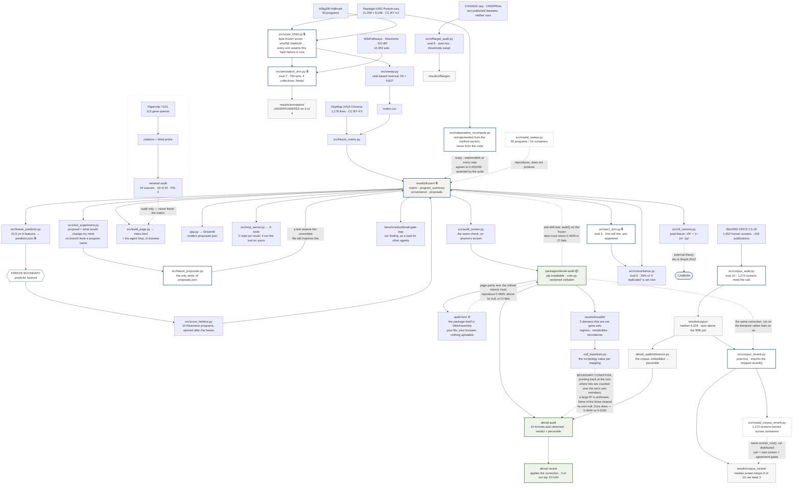

# Architecture

**The freeze boundary is the load-bearing part.** `results/frozen/` is written once per run and read by everything downstream; nothing after it recomputes. The predictor is fit on the 50 scored programs, serialised, and **hashed** — and only then are the ten held-out programs scored, with `src/score_heldout.py` verifying the hash at load and aborting on mismatch. Scoring them before the freeze would have let the model see its own test set; scoring them after means the failure it produced is a real failure.

**Evaluations 5–8 point sideways, and that is the whole discipline.** `src/annotation_arm.py`, `src/concordance.py`, `src/rpe1_arm.py` and `src/offtarget_audit.py` each write their own directory — `results/annotation/`, `results/concordance/`, `results/rpe1/`, `results/offtarget/` — and **not one of them has an edge back into `results/frozen/`.** That is deliberate. Every one of those arms was built after the primary was frozen, so any of them could have been used to quietly improve the headline: re-score with a looser gate, fold the second cell line in, let a 793-set sweep redefine the comparator. Pointing them sideways makes that impossible to do by accident rather than merely against the rules. What they are allowed to change is the *scope* of the claim — evaluation 7 narrowed it by showing more than half of GO Biological Process cannot be evaluated against this screen at all, and evaluation 8 widened it by finding the same confound in two clinical off-target datasets that have nothing to do with gene sets. Neither moved a number inside the freeze. The two arms that read the byte-frozen scorer, `src/annotation_arm.py` and `src/rpe1_arm.py`, assert its sha256 before they run and abort rather than proceed against a modified scorer.

**`src/freeze_proposals.py` is drawn as the only writer of `proposals.json` because that turned out to matter.** The three generated proposals the page renders are produced by `src/next_experiment.py` and serialised once by that script. It went stale — the generator gained a falsification field and the artifact was never rewritten — and because nothing checked the artifact against its generator, `make all` on a clean clone silently rewrote it and made the byte-identical reproduction claim false while every other test stayed green. The edge back into `results/frozen/` now carries that check.

**The dashed edges are claims you can check, and there are now four of them.** Modal points *into* `results/frozen/` rather than out of it: `src/modal_sweep.py` re-runs the sweep across ten containers and reproduces all 50 programs identically, so it verifies the frozen result without being allowed to produce it — it is deliberately not a `make all` step, and a test asserts that. The VIF edge points *outward*, to a statistical result published in 2012: our two dominant features turn out to be the two terms of CAMERA's variance-inflation factor, which we recovered from data rather than fitted to.

**The packaged tool is drawn downstream of the freeze, with one edge pointing back.** `packages/denali-audit` is what a stranger installs, and it is not a rewrite: `core.py` is the study's own maths vendored verbatim, `reference.py` carries the 1,272-screen corpus so an audit can say where a ranking sits rather than only what its R² is, and `denali rerank` applies the correction. The dashed edge back into `results/frozen/` is the claim that makes the whole arrangement honest — **a test runs the packaged `audit()` against the frozen research data and requires exactly `0.4649`**, the published headline. If the tool and the paper ever disagree, CI fails rather than the two quietly diverging and the README continuing to cite a number the shipped code no longer produces. That is the difference between a tool that came out of a study and a tool that merely resembles one.

**The two strongest validation artifacts are now drawn, because leaving them out flattered the diagram.** The first is the corpus: `src/corpus_audit.py` reads BioGRID ORCS 2.0.18, keeps the 1,272 screens that meet a stated inclusion rule, and writes `results/corpus/` — and the edge that matters runs from there into `denali_audit/reference.py`, because that is where the percentile a stranger sees comes from. Without that edge the tool appears to assert "worse than nine in ten screens" out of nowhere; with it, the claim has a substrate, an inclusion rule and a file. `src/corpus_rerank.py` then takes the *shipped* `rerank()` — imported from the package, not reimplemented — and runs it over the same 1,272 screens, which is why its edge comes from `packages/denali-audit` rather than from the study. The second is `src/independent_recompute.py`, which rebuilt the headline from this README's method section without reading the frozen code, and whose dashed edge into `results/frozen/` is an agreement to 0.000049 that the suite asserts. Both are checks *on* the project rather than steps *in* it, which is exactly why they were the easiest two to forget to draw.

**Paperclip is drawn as a side branch that terminates in the retrieval audit, because that is what it is.** It produced per-gene citations and a blind probe, and those numbers appear on the page — but nothing it generated feeds `matrix.csv`, the predictor, or any frozen result. The per-gene divergence table that once consumed it was withdrawn when guide-pair concordance made per-gene verdicts indefensible.
