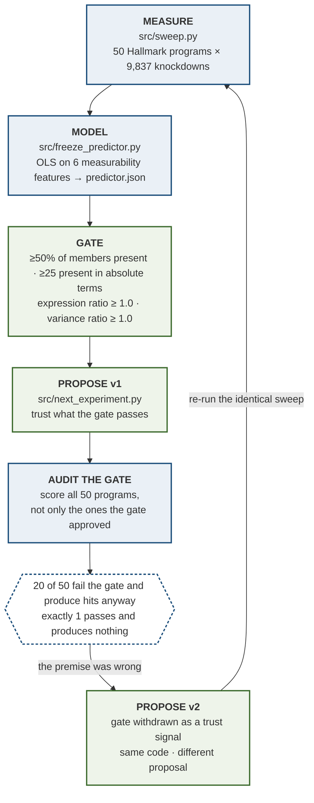
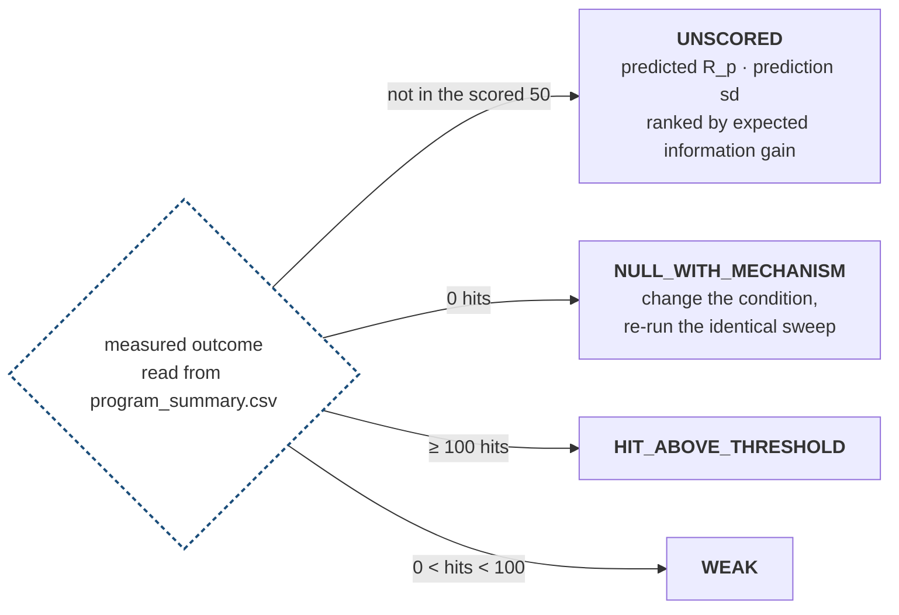

# The loop

Criterion 1 asks whether the agent analyses data it has not seen and proposes a
next experiment **that changes when the results change**. This document shows the
loop denali actually runs, names the file behind every stage, and gives the
ten-second check that falsifies the claim.

Every number here is read from a result file — `results/frozen/` for the first
lap, and the arm's own result file for each later one. Sources are listed at the
end.

## The loop



Blue is evidence, green is action.

## The loop ran again, seven more times, and three times it stopped itself

The turn above is the first lap. It is not the only one. Each later lap re-enters
at **MEASURE** with a different substrate and the same byte-frozen scorer, and
three of them stopped on a rule written before the run rather than on a judgement
made after it — two halting outright, one gating its own question.

```mermaid
flowchart TB
  L1["<b>LAP 1 · the gate</b><br/>50 Hallmark programs, K562<br/>gate withdrawn as a trust signal"]
  L2["<b>LAP 2 · held out</b><br/>10 Reactome programs, opened after the freeze<br/>eval 3"]
  H1{{"<b>HALT</b> — pre-registered rule fired<br/>1 of 10 passed the gate, floor was 8 of 10<br/>balanced accuracy 0.4375, zero true positives<br/><b>not refit</b>"}}
  L3["<b>LAP 3 · second cell line</b><br/>RPE1, independently screened<br/>eval 5 · pre-registered"]
  L4["<b>LAP 4 · do two screens agree?</b><br/>K562 vs RPE1 rank agreement<br/>eval 6 · post-freeze"]
  L5["<b>LAP 5 · other annotations</b><br/>793 sets, 4 collections<br/>eval 7 · pre-registered"]
  H2{{"<b>HALT</b> — pre-registered power rule fired<br/>fewer than 150 of 250 sets scoreable<br/>NO VERDICT ISSUED · direction predicted WRONG"}}
  L6["<b>LAP 6 · outside our own data</b><br/>two published off-target datasets<br/>eval 8 · post-hoc, thresholds swept"]
  L7["<b>LAP 7 · switch the program on</b><br/>Adamson UPR Perturb-seq<br/>eval 9 · pre-registered before the substrate was opened"]
  G1{{"<b>GATE FIRST</b> — engagement, or no question<br/>0.0551 observed vs null p99 0.0487, p = 0.001<br/>only then is size asked: R² 0.2685"}}
  L8["<b>LAP 8 · does the headline describe the field?</b><br/>1,272 published screens, BioGRID ORCS<br/>eval 10 · post-hoc"]
  H3{{"<b>TURNED ON ITSELF</b> — the corpus is not 1,272 labs<br/>187 publications, one contributes 26.7%<br/>collapse to publications: 9.6% → 26.7% reach our 0.465<br/>the correction that costs us the headline"}}

  L1 --> L2 --> H1
  H1 -->|"predictor kept, not repaired"| L3
  L3 -->|"R² 0.276, cleared ≥0.25 by 0.026"| L4
  L4 -->|"26% of the agreement is set size"| L5
  L5 --> H2
  H2 -->|"take the confound somewhere it cannot be ours"| L6
  L6 -->|"17.6–33.9% of assay agreement is search yield"| L7
  L7 --> G1
  G1 -->|"it persists when the program is engaged"| L8
  L8 --> H3
  H3 -->|"the tool's own question, asked of the tool"| H3

  style L1 fill:#eaf0f6,stroke:#1a4d7a,stroke-width:2px
  style L2 fill:#eaf0f6,stroke:#1a4d7a,stroke-width:2px
  style L3 fill:#eaf0f6,stroke:#1a4d7a,stroke-width:2px
  style L4 fill:#eaf0f6,stroke:#1a4d7a,stroke-width:2px
  style L5 fill:#eaf0f6,stroke:#1a4d7a,stroke-width:2px
  style L6 fill:#eaf0f6,stroke:#1a4d7a,stroke-width:2px
  style L7 fill:#eaf0f6,stroke:#1a4d7a,stroke-width:2px
  style L8 fill:#eaf0f6,stroke:#1a4d7a,stroke-width:2px
  style H1 fill:#fff,stroke:#8a1a1a,stroke-width:2px,stroke-dasharray:4 3
  style H2 fill:#fff,stroke:#8a1a1a,stroke-width:2px,stroke-dasharray:4 3
  style G1 fill:#fff,stroke:#3d6b2e,stroke-width:2px,stroke-dasharray:4 3
  style H3 fill:#fff,stroke:#8a1a1a,stroke-width:2px,stroke-dasharray:4 3
```



**The halts are the point.** A loop that only ever continues is not being
governed by anything. Twice, a rule fixed in advance stopped this one outright,
before the statistic it was built to compute could be read:

- **Lap 2, the held-out evaluation.** The rule — inconclusive below 8 of 10
  programs passing the measurability gate — was written before any held-out
  number was visible. Only 1 of 10 passed. Balanced accuracy came back at
  **0.4375** with zero true positives, worse than chance, and the predictor was
  **not refit**. The loop carried a broken predictor forward and said so rather
  than repairing it into something that would have looked better.
- **Lap 5, the annotation arm.** The rule — fewer than 150 of 250 sets scoreable
  — fired on three of four collections, so **no verdict issued** and the R²
  values carry none. The same arm also found our predicted direction was
  **wrong**: the confound was weaker in the looser collections, not stronger.
  Two failures, both reported.

The laps that did not halt still changed what the next one asked. Lap 3 (RPE1,
pre-registered) cleared its ≥0.25 bar by 0.026 — thin, and labelled thin — which
is what made lap 4 worth running: if the size effect holds in two screens, then
the *agreement* between those screens is the thing to audit. It found **26%** of
that agreement is carried by set size. That in turn is what sent lap 6 outside
this project's data entirely, to two published off-target datasets, where the
same confound reappears as a guide's search yield explaining **17.6–33.9%**
(median 31.2%) of the agreement between a biochemical and a cellular assay.

**Lap 7 put a gate in front of the question instead of after it.** The standing
objection to the whole project is that K562 is unstressed, so a null says nothing.
Lap 7 (Adamson, pre-registered *before the substrate was opened*) could only ask
its question if engagement was established first, against a null of 1,000 gene
sets matched on size and control-expression decile: observed **0.0551** against a
null 99th percentile of **0.0487**, empirical **p = 0.001**. Engagement cleared,
so the size question was asked and answered — **R² 0.2685**, persists. Had the
gate not cleared, the arm had no result to report and would have said so. Note
what this lap does *not* claim: a targeted UPR library is the worst substrate
imaginable for a claim about unbiased screens, so it is used only for engagement,
and its single-cell construction is new code outside the frozen scorer's hash.

**Lap 8 turned the audit on the audit.** Having asked the field's screens how much
of their rankings is construction, it asked the same of its own corpus — and the
corpus failed. Those 1,272 screens come from **187 publications**; one contributes
**26.7%** of them. Collapse each publication to its median screen and the share of
the literature reaching our 0.465 moves from **9.6% to 26.7%**, putting denali at
roughly the 73rd percentile rather than the 90th. **The tightness of the
screen-level distribution was itself an artifact of how the corpus was counted** —
which is this project's own thesis, occurring inside this project's own audit. It
leads the writeup because it costs us the number.

Laps 4, 6 and 8 are **post-freeze or post-hoc**, and are labelled so wherever they
appear; laps 3, 5 and 7 were pre-registered and hashed before they ran. Sources:
`results/frozen/heldout_evaluation.json`, `results/rpe1/`,
`results/concordance/`, `results/annotation/annotation_evaluation.json`,
`results/offtarget/offtarget_evaluation.json`,
`results/adamson/adamson_evaluation.json`, `results/corpus/corpus_audit.json`.

## Why this is a loop and not a flowchart

A flowchart would end at **PROPOSE v1**. The loop closes because the **AUDIT**
stage invalidated the **GATE** stage that **PROPOSE v1** depended on, and the
proposal changed as a result.

The measurability gate is the filter anyone building this would build. We built
it, and then — instead of applying it and moving on — we checked it against all
50 programs rather than only the ones it approved. **20 of 50 fail the gate and
produce hits anyway. Exactly 1 passes and produces nothing.** The filter would
have discarded 20 results, including the held-out program, which fails the gate
on an expression ratio of 0.92 and still ranks 11th of 50 with 773 hits.

So the gate was withdrawn as a trust signal. No code branch changed; the measured
input to those branches did. That is the loop closing, and it is the reason the
gate failure is reported as a primary result rather than a footnote.

## What the proposal is branched on



Four outcomes, four different next experiments, selected entirely by measured
quantities.

## The claim, and how to falsify it in ten seconds

> **No branch in `src/next_experiment.py` tests a program name.**

Every branch reads measured values from `results/frozen/program_summary.csv` and
the six measurability features. Change the data and the proposal changes; leave
the data alone and it does not. That is the criterion stated as a property of the
code rather than as an assertion about intent.

Check it:

```bash
grep -n 'HALLMARK_\|REACTOME_' src/next_experiment.py
```

If that returns a branch condition, the claim is false. It returns nothing.

Run it against any program:

```bash
.venv/bin/python -m src.next_experiment HALLMARK_CHOLESTEROL_HOMEOSTASIS
.venv/bin/python -m src.next_experiment --demo
```

## Where each number comes from

| Number | Source |
|---|---|
| 50 programs · 9,837 knockdown targets | `results/frozen/provenance.json` → `tier1` |
| gate: ≥0.50 fraction, ≥25 present, ratios ≥1.0 | `src/sweep.py:32` (`MIN_FRAC, MIN_N, ALPHA`), `src/sweep.py:102` |
| 20 fail the gate and produce hits | `provenance.json` → `gap_numbers.gate_fail_but_has_hits` |
| 1 passes and produces nothing | `provenance.json` → `gap_numbers.gate_pass_but_zero_hits` |
| held-out program: expr_ratio 0.92, rank 11, 773 hits | `results/frozen/program_summary.csv` |
| hit threshold of 100 | `src/next_experiment.py` (`HIT_MIN_HITS`), matching `reversibility_call == "reversible"` |
| lap 2: 1 of 10 passing, floor of 8 of 10, balanced accuracy 0.4375, not refit | `results/frozen/heldout_evaluation.json` |
| lap 3: RPE1 size-alone R² 0.276, bar ≥0.25, cleared by 0.026 | `results/rpe1/rpe1_evaluation.json` |
| lap 4: 26% of cross-screen agreement is set size | `results/concordance/cross_screen.json` |
| lap 5: 150-of-250 power rule, no verdict issued, direction wrong | `results/annotation/annotation_evaluation.json` |
| lap 6: 17.6–33.9% (median 31.2%) of assay agreement is search yield | `results/offtarget/offtarget_evaluation.json` |
| lap 7: engagement 0.0551 vs null p99 0.0487, p = 0.001; size R² 0.2685 | `results/adamson/adamson_evaluation.json` |
| lap 8: 1,272 screens / 187 publications, 9.6% → 26.7% after collapsing | `results/corpus/corpus_audit.json` |

## Scope

The loop is a claim about how the proposal is generated, not about the biology of
any program. Guide-pair concordance is −0.019, so no gene-level result is claimed
anywhere and no novel gene is named; the build fails if one appears near verdict
language. The predictor whose residual feeds the UNSCORED branch **failed its own
held-out evaluation** at balanced accuracy 0.4375 with zero true positives, and it
was not refit. The proposals are reported, not endorsed.
