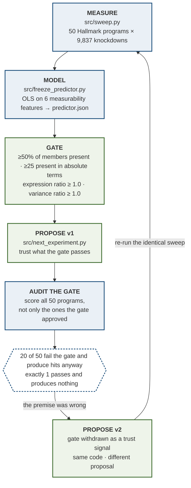
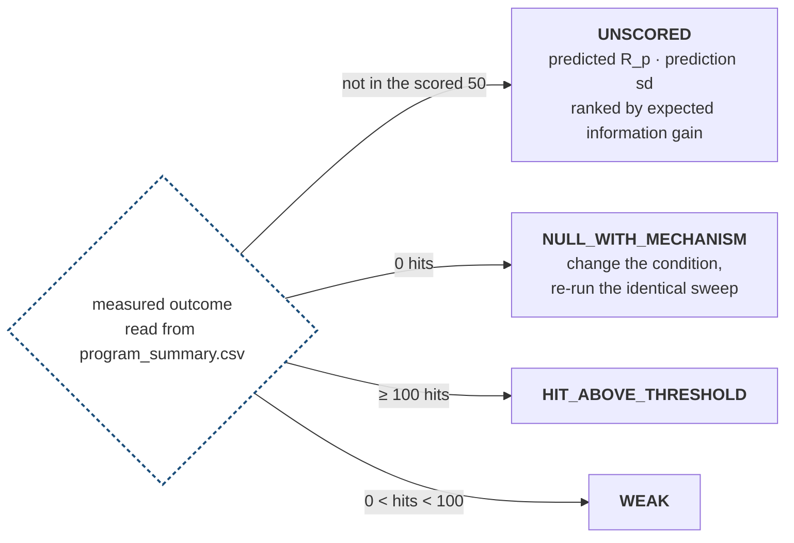

# The loop

Criterion 1 asks whether the agent analyses data it has not seen and proposes a
next experiment **that changes when the results change**. This document shows the
loop denali actually runs, names the file behind every stage, and gives the
ten-second check that falsifies the claim.

Every number here is read from `results/frozen/`. Sources are listed at the end.

## The loop



Blue is evidence, green is action.

## Why this is a loop and not a flowchart

A flowchart would end at **PROPOSE v1**. The loop closes because the **AUDIT**
stage invalidated the **GATE** stage that **PROPOSE v1** depended on, and the
proposal changed as a result.

The measurability gate is the filter anyone building this would build. We built
it, and then — instead of applying it and moving on — we checked it against all
50 programs rather than only the ones it approved. **20 of 50 fail the gate and
produce hits anyway. Exactly 1 passes and produces nothing.** The filter would
have discarded 20 results, including the held-out program, which fails the gate
on an expression ratio of 0.92 and still ranks 11th of 50 with 773 hits.

So the gate was withdrawn as a trust signal. No code branch changed; the measured
input to those branches did. That is the loop closing, and it is the reason the
gate failure is reported as a primary result rather than a footnote.

## What the proposal is branched on



Four outcomes, four different next experiments, selected entirely by measured
quantities.

## The claim, and how to falsify it in ten seconds

> **No branch in `src/next_experiment.py` tests a program name.**

Every branch reads measured values from `results/frozen/program_summary.csv` and
the six measurability features. Change the data and the proposal changes; leave
the data alone and it does not. That is the criterion stated as a property of the
code rather than as an assertion about intent.

Check it:

```bash
grep -n 'HALLMARK_\|REACTOME_' src/next_experiment.py
```

If that returns a branch condition, the claim is false. It returns nothing.

Run it against any program:

```bash
.venv/bin/python -m src.next_experiment HALLMARK_CHOLESTEROL_HOMEOSTASIS
.venv/bin/python -m src.next_experiment --demo
```

## Where each number comes from

| Number | Source |
|---|---|
| 50 programs · 9,837 knockdown targets | `results/frozen/provenance.json` → `tier1` |
| gate: ≥0.50 fraction, ≥25 present, ratios ≥1.0 | `src/sweep.py:32` (`MIN_FRAC, MIN_N, ALPHA`), `src/sweep.py:102` |
| 20 fail the gate and produce hits | `provenance.json` → `gap_numbers.gate_fail_but_has_hits` |
| 1 passes and produces nothing | `provenance.json` → `gap_numbers.gate_pass_but_zero_hits` |
| held-out program: expr_ratio 0.92, rank 11, 773 hits | `results/frozen/program_summary.csv` |
| hit threshold of 100 | `src/next_experiment.py` (`HIT_MIN_HITS`), matching `reversibility_call == "reversible"` |

## Scope

The loop is a claim about how the proposal is generated, not about the biology of
any program. Guide-pair concordance is −0.019, so no gene-level result is claimed
anywhere and no novel gene is named; the build fails if one appears near verdict
language. The predictor whose residual feeds the UNSCORED branch **failed its own
held-out evaluation** at balanced accuracy 0.4375 with zero true positives, and it
was not refit. The proposals are reported, not endorsed.
